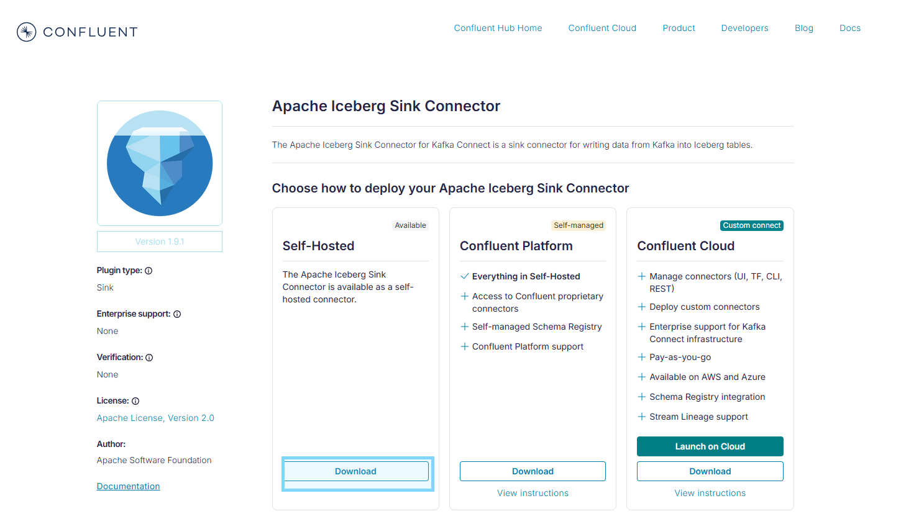
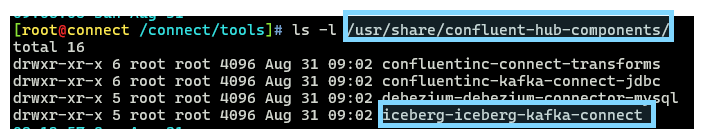
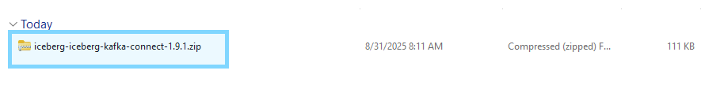
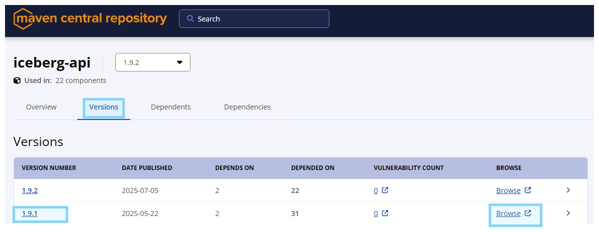
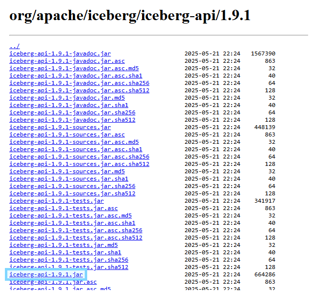

<<<<<<< HEAD
# Setup
- **Copy `.env.example` to `.env`**
- **Disable interceptor** as not available in community package
    - set in `docker-compose.yml`
```properties
CONNECT_PRODUCER_INTERCEPTOR_CLASSES=""
CONNECT_CONSUMER_INTERCEPTOR_CLASSES: ""
```

=======
>>>>>>> d209b779cc08fec9de2033a71536003c607462c5
# Dockerfile References
- **Dockerfile:** 
    - https://github.com/confluentinc/cp-all-in-one/blob/7.9.0-post/cp-all-in-one-cloud/Dockerfile-connect
    - https://github.com/confluentinc/cp-all-in-one/blob/7.9.0-post/cp-all-in-one-cloud/docker-compose.connect.yml
- **Connector Config:** https://docs.confluent.io/platform/current/installation/docker/config-reference.html#kconnect-long-configuration

# KSQL-CLI
- To open ksqlDB CLI session connected to ksqlDB server, run:
```sh
docker exec -it ksqldb-cli ksql --config-file /etc/ksqldb-cli.properties http://ksqldb-server:8088
docker exec -it ksqldb-cli ksql --config-file /etc/ksqldb-cli.properties http://ksqldb-server:8088 -e "SHOW STREAMS;"
```

# Sink-Iceberg Connector Installation
- **Download from Confluent Hub** via https://www.confluent.io/hub/iceberg/iceberg-kafka-connect



- **`(Option 1)` Move the unzip folder to `/usr/share/confluent-hub-components`**



- **`(Option 2)` Download via Confluent-Hub CLI**
    - Change the plugin name based on downloaded zip file name
    - From zip file name `iceberg-iceberg-kafka-connect-1.9.1.zip` to `iceberg/iceberg-kafka-connect:1.9.1`
        
    - **Download plugin:** 
        ```shell
        confluent-hub install --no-prompt iceberg/iceberg-kafka-connect:1.9.1
        ```
- **Download dependencies:** 
    - Find the link from maven (https://central.sonatype.com/)
        - `iceberg-api`
        - `iceberg-core`
        - `iceberg-common`

        
        

    - Use `wget` to download to `/usr/share/confluent-hub-components` lib folder
        ```shell
        wget -P /usr/share/confluent-hub-components/iceberg-iceberg-kafka-connect/lib/ https://repo1.maven.org/maven2/org/apache/iceberg/iceberg-api/1.9.1/iceberg-api-1.9.1.jar && \
        wget -P /usr/share/confluent-hub-components/iceberg-iceberg-kafka-connect/lib/ https://repo1.maven.org/maven2/org/apache/iceberg/iceberg-core/1.9.1/iceberg-core-1.9.1.jar && \
        wget -P /usr/share/confluent-hub-components/iceberg-iceberg-kafka-connect/lib/ https://repo1.maven.org/maven2/org/apache/iceberg/iceberg-common/1.9.1/iceberg-common-1.9.1.jar && \
        wget -P /usr/share/confluent-hub-components/iceberg-iceberg-kafka-connect/lib/ https://repo1.maven.org/maven2/org/apache/iceberg/iceberg-bundled-guava/1.9.1/iceberg-bundled-guava-1.9.1.jar
        ```

    - **MUST restart connector worker** via restart docker container
