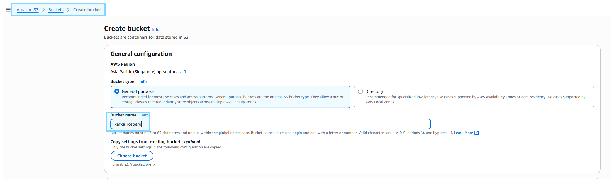
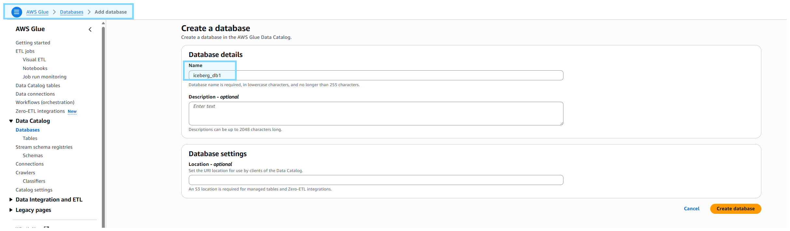
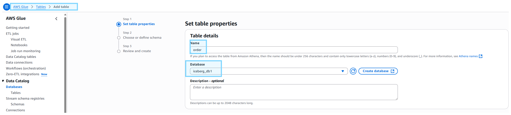
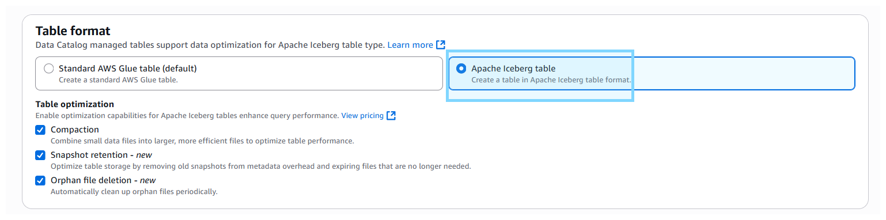
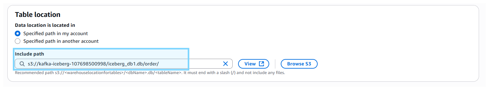

# Dockerfile References
- **Dockerfile:** 
    - https://github.com/confluentinc/cp-all-in-one/blob/7.9.0-post/cp-all-in-one-cloud/Dockerfile-connect
    - https://github.com/confluentinc/cp-all-in-one/blob/7.9.0-post/cp-all-in-one-cloud/docker-compose.connect.yml
- **Connector Config:** https://docs.confluent.io/platform/current/installation/docker/config-reference.html#kconnect-long-configuration

# Setup
- **Copy `.env.example` to `.env` fill up value below**
    - Must create IAM access key with `AmazonS3FullAccess`, `AWSGlueConsoleFullAccess` permission
```properties
AWS_ACCESS_KEY_ID= 
AWS_SECRET_ACCESS_KEY=
```
- **Disable interceptor** as not available in community package
    - set in `docker-compose.yml`
```properties
CONNECT_PRODUCER_INTERCEPTOR_CLASSES=""
CONNECT_CONSUMER_INTERCEPTOR_CLASSES: ""
```
- **Start docker container** via `docker compose up -d`

# `[Optional]` Build Sink-Iceberg Connector
- **Install Java (openjdk)**
    - `sudo apt update && sudo apt install openjdk-17-jdk`
    - `update-alternatives --config java` to get JAVA_HOME path value
    - vim `~/.bash_profile`
        - put result from `update-alternatives --config java` to `JAVA_HOME` env value
        ```shell
        export JAVA_HOME= #EXAMPLE = /usr/lib/jvm/java-17-openjdk-amd64
        export PATH=$PATH:$JAVA_HOME/bin
        ```
    - `source ~/.bash_profile`
    - `echo $JAVA_HOME` to verify

- **Gradle build**
    - Clone apache-iceberg repo
        ```shell
        git clone https://github.com/apache/iceberg.git
        cd iceberg
        ```
    - Build
        ```shell
        cd kafka-connect
        ../gradlew -x test -x integrationTest clean build
        ```
    - Move the plugin folder to connector plugin path
        - Replace `<PLUGIN_PATH>` below to this repo's `plugins folder path`
        ```shell
        cd kafka-connect-runtime/build/distributions/ && ls -l
        cp /connect/plugins/iceberg-kafka-connect-runtime-hive-1.11.0-SNAPSHOT -d <PLUGIN_PATH>`
        ```


# Setup AWS S3 & Glue Database/Tables
- **Create S3 bucket**



- **Create Glue Database**



- **Create Glue Table**
    - For IAM role
        - MUST create role with `AmazonS3FullAccess`, `AWSGlueConsoleFullAccess` 
        - MUST add **Trust Relationships** below in `IAM > Role > Trust Relationships`
            ```json
            {
                "Version": "2012-10-17",
                "Statement": [
                    {
                        "Effect": "Allow",
                        "Principal": {
                            "Service": [
                                "glue.amazonaws.com"
                            ]
                        },
                        "Action": "sts:AssumeRole"
                    }
                ]
            }
            ```




