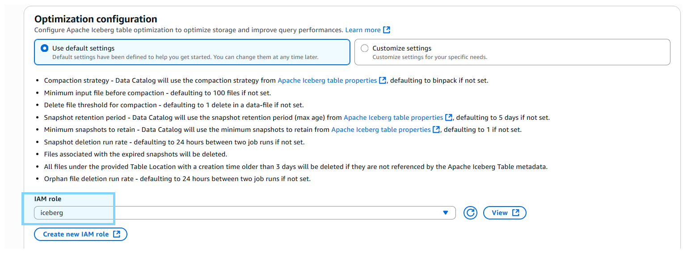

# Dockerfile References
- **Dockerfile:** 
    - https://github.com/confluentinc/cp-all-in-one/blob/7.9.0-post/cp-all-in-one-cloud/Dockerfile-connect
    - https://github.com/confluentinc/cp-all-in-one/blob/7.9.0-post/cp-all-in-one-cloud/docker-compose.connect.yml
- **Connector Config:** https://docs.confluent.io/platform/current/installation/docker/config-reference.html#kconnect-long-configuration

# Setup
- **Copy `.env.example` to `.env` fill up value below**
    - Must create IAM access key with `AmazonS3FullAccess`, `AWSGlueConsoleFullAccess` permission
```properties
AWS_ACCESS_KEY_ID= 
AWS_SECRET_ACCESS_KEY=
```
- **Disable interceptor** as not available in community package
    - set in `docker-compose.yml`
```properties
CONNECT_PRODUCER_INTERCEPTOR_CLASSES=""
CONNECT_CONSUMER_INTERCEPTOR_CLASSES: ""
```
- **Start docker container** via `docker compose up -d`

# `[Optional]` Build Sink-Iceberg Connector
- **Install Java (openjdk)**
    - `sudo apt update && sudo apt install openjdk-17-jdk`
    - `update-alternatives --config java` to get JAVA_HOME path value
    - vim `~/.bash_profile`
        - put result from `update-alternatives --config java` to `JAVA_HOME` env value
        ```shell
        export JAVA_HOME= #EXAMPLE = /usr/lib/jvm/java-17-openjdk-amd64
        export PATH=$PATH:$JAVA_HOME/bin
        ```
    - `source ~/.bash_profile`
    - `echo $JAVA_HOME` to verify

- **Gradle build**
    - Clone apache-iceberg repo
        ```shell
        git clone https://github.com/apache/iceberg.git
        cd iceberg
        ```
    - Build
        ```shell
        cd kafka-connect
        ../gradlew -x test -x integrationTest clean build
        ```
    - Move the plugin folder to connector plugin path
        - Replace `<PLUGIN_PATH>` below to this repo's `plugins folder path`
        ```shell
        cd kafka-connect-runtime/build/distributions/ && ls -l
        cp /connect/plugins/iceberg-kafka-connect-runtime-hive-1.11.0-SNAPSHOT -d <PLUGIN_PATH>`
        ```


# Setup AWS S3 Bucket
- **Create S3 bucket**


# Setup Glue Database & Tables
## Create Glue Database


## Create Glue Table `(AWS Console)`
- For IAM role
    - MUST create role with `AmazonS3FullAccess`, `AWSGlueConsoleFullAccess` 
    - MUST add **Trust Relationships** below in `IAM > Role > Trust Relationships`
        ```json
        {
            "Version": "2012-10-17",
            "Statement": [
                {
                    "Effect": "Allow",
                    "Principal": {
                        "Service": [
                            "glue.amazonaws.com"
                        ]
                    },
                    "Action": "sts:AssumeRole"
                }
            ]
        }
        ```





## Create Glue Table `(Glue ETL Job)`

- **Create Spark script**


- **Set IAM role**
    - MUST create role with `AmazonS3FullAccess`, `AWSGlueConsoleFullAccess`, `CloudWatchFullAccess`


- **Set job parameters** at `Advanced properties > Job parameters`
    - Key: `--datalake-formats`
    - Value: 
        ```shell
        # Must update <ICEBERG_S3_BUCKET> below
        spark.sql.catalog.glue_catalog=org.apache.iceberg.spark.SparkCatalog --conf spark.sql.catalog.glue_catalog.warehouse=s3://<ICEBERG_S3_BUCKET>/iceberg-warehouse/ --conf spark.sql.catalog.glue_catalog.catalog-impl=org.apache.iceberg.aws.glue.GlueCatalog --conf spark.sql.catalog.glue_catalog.io-impl=org.apache.iceberg.aws.s3.S3FileIO --conf spark.sql.extensions=org.apache.iceberg.spark.extensions.IcebergSparkSessionExtensions.
        ```
    
- **PySpark script**
```python
import sys
from awsglue.utils import getResolvedOptions
from pyspark.sql.session import SparkSession

# Get job parameters
args = getResolvedOptions(sys.argv, ['JOB_NAME'])

# Initialize Spark session with Iceberg configurations from job parameters
spark = SparkSession.builder.appName(args['JOB_NAME']).getOrCreate()

# First, drop the existing table to ensure a clean slate.
print("Dropping existing table iceberg_db1.order if it exists...")
spark.sql("DROP TABLE IF EXISTS glue_catalog.iceberg_db1.order")

# Create the Iceberg table using Spark SQL
# Define the 'id' field as NOT NULL during creation
print("Creating new Iceberg table iceberg_db1.order...")
spark.sql("""
CREATE TABLE glue_catalog.iceberg_db1.order (
  id INT NOT NULL,
  product STRING,
  amount INT,
  buyer_id INT,
  create_date STRING,
  update_date STRING,
  row_time LONG
)
USING iceberg
LOCATION 's3://kafka-iceberg-107698500998/iceberg_db1.db/order'
TBLPROPERTIES (
  'format-version'='2',
  'write.parquet.compression-codec'='zstd'
)
""")

# Now that 'id' is guaranteed to be NOT NULL, set it as the identifier field
print("Setting identifier field 'id' for the new table...")
spark.sql("ALTER TABLE glue_catalog.iceberg_db1.order SET IDENTIFIER FIELDS id")

# Verify the table schema and properties
print("Verifying table schema after creation...")
spark.sql("DESCRIBE EXTENDED glue_catalog.iceberg_db1.order").show(truncate=False)

# check table properties
print("Check table properties...")
spark.sql("SHOW TBLPROPERTIES glue_catalog.iceberg_db1.order").show(truncate=False)

# Stop the Spark session
print("New table iceberg_db1.order has been created and configured correctly.")
spark.stop()
```

- **Run Glue job & check logs**